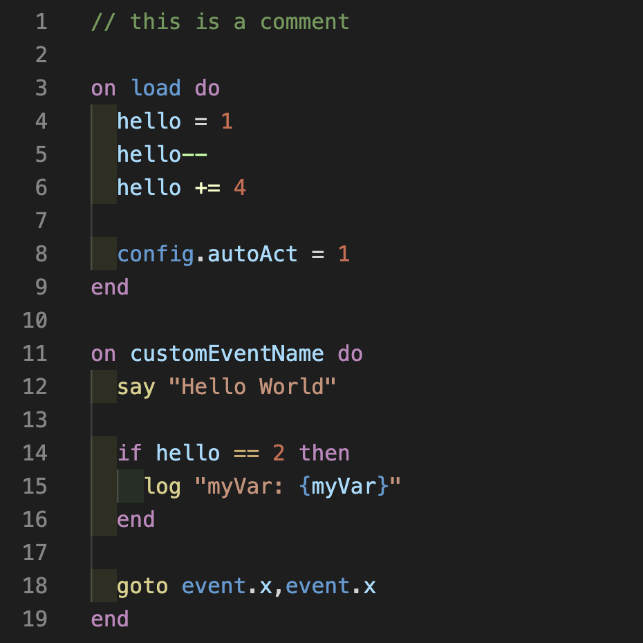

# PulpScript Syntax

This is an unofficial extension providing syntax highlighting for PulpScript. It is not sponsored, endorsed, licensed by, or affiliated with Panic.

  

## Filenames

The following filename extensions are supported:

  - `.ps`
  - `.pulp`
  - `.pulpscript`

## Links

- [PulpScript Docs](https://play.date/pulp/docs/pulpscript/)
- [Pulp Docs](https://play.date/pulp/docs/)
- [Pulp](https://play.date/pulp/)
